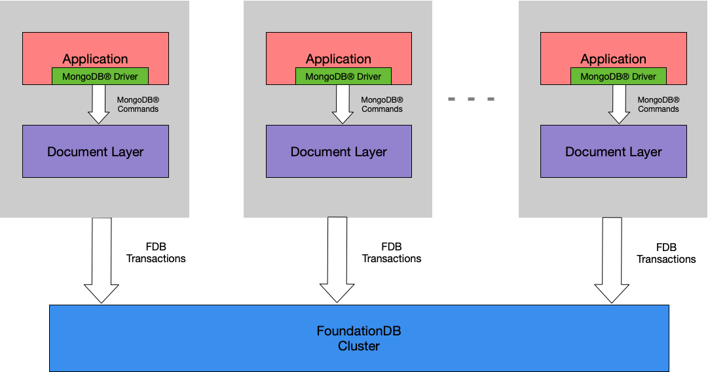
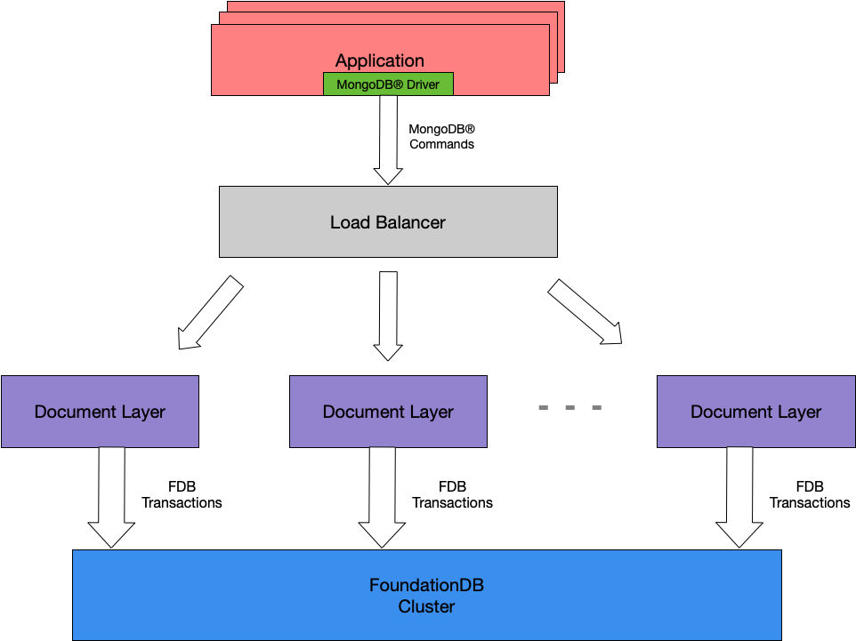

# Architecture

The Document Layer is a stateless microserver backed by the FoundationDB
Key-Value Store. All the persistent state (documents, indexes, metadata,
etc.) are stored in the Key-Value Store. The Document Layer together with the FoundationDB
Key-Value store form a scalable and fault-tolerant document database. In the traditional
database nomenclature, the Document Layer is the query engine and the Key-Value Store is the
storage engine.

Since the Document Layer is stateless, scalability and fault-tolerance can be
provided by running multiple instances.
As FoundationDB is [scalable](https://apple.github.io/foundationdb/performance.html) and
[fault-tolerant](https://apple.github.io/foundationdb/fault-tolerance.html), this results in
horizontally scallable and fault-tolerant architecture.

## Deployment Models

The Document Layer can be deployed either as a sidecar or an instance pool.

### Sidecar

The Document Layer instance runs on the same host as
the application instance. Each application instance is coupled
with the local the Document Layer instance and only connects to it.
This makes both security and service discovery easy.

Application deployment needs to make sure, the Document Layer instances
start and stop together with application instances. Also,
FoundationDB C libraries need to installed on application instances
and updated on FoundationDB server upgrades.

### Instance pool with Load balancer

The Document Layer instances are maintained as a service separate from
application. Applications connect to the Document Layer instances through
a load balancer which rotates new connections through the Document Layer instances.
Application deployment need not do anything special for either the Document Layer or
FoundationDB.

As the application sees the instance pool through load balancer, reconnection
to the same IP could go to different instance. This makes it hard to depend on
any server state. In this setup, the Document Layer transactions do not provide
correct consistency guarantees. Transactions should not be used in this model.

**Note:** Cursors work properly as cursor requests come with an ID, which is used
to fail the request that went to wrong server.

## Architectural advantages

Here is a selection of fundamental design advantages of Document
Layer over MongoDB®.

### No write locks

The Document Layer does not implement locks on the database for write
operations. The Key-Value Store uses optimistic concurrency control
instead of locking. In some cases, operations may have to retry due to
conflicts; non-conflicting operations, including metadata
operations, can always proceed in parallel on the same instance.

### No sharding

The Document Layer does not rely on sharding with a fixed shard key to
distribute data. Instead, all data partitioning and rebalancing is
handled automatically by the Key-Value Store and is transparent to the
client application. This approach provides robust horizontal scalability
while avoiding the client-level complexity.

### Memory management

Both the Document Layer and the Key-Value Store have predictable memory
usage.

### No config servers or mongos routers

There are no config servers or `mongos` routers. Cluster topology remains
uniform as the overall application deployment changes.

### Safe behavior

By default, write operations on the Document Layer execute with
document-level isolation and atomicity. Unsuccessful operations are
reported to the client, rather than failing silently after execution.
Indexes are always consistent with inserts and updates as they are
written together in a FoundationDB transaction. Write concern and Read
preference do not matter as writes are fully consistent
irrespective of write concern. Reads always see causal consistency.

### No table compaction

The Document Layer does not need to perform offline table compaction,
which incurs unnecessary overhead.
